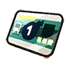

   
  
   
   

  

    <strong>👻 A daily Yo-kai guessing game inspired by Wordle.</strong>
  

  

    Test your knowledge of the Yo-kai Watch universe! Guess the daily Yo-kai using clues about their Tribe, Rank, Element, Attribute, and more.
  

   

  

   
   

  <!-- Tribe Icons / Decoration (Optional, using text for now if no generic tribe assets handy in valid path) -->
  

    🟢 <strong>Correct</strong> &nbsp;|&nbsp; 🟡 <strong>Partial</strong> &nbsp;|&nbsp; 🔴 <strong>Incorrect</strong>
  

 

 

## 🎮 Game Modes

<table border="0">
  <tr>
    <td width="300" align="center" valign="top">
      
      <h3>Daily Challenge</h3>
      
The classic mode. One Yo-kai, one attempt per day. Everyone in the world gets the same Yo-kai. Compete globally!

    </td>
    <td width="300" align="center" valign="top">
      
      <h3>Infinite Mode</h3>
      
Addicted to the loop? Infinite Mode helps you practice without limits. Build the highest streak possible!

    </td>
  </tr>
</table>

 

## ✨ Features

<table border="0">
  <tr>
    <td width="50" align="center"></td>
    <td><strong>Smart Clues</strong>: Visual feedback on every guess. Learn from your mistakes!</td>
  </tr>
  <tr>
    <td width="50" align="center"></td>
    <td><strong>Medallium</strong>: Collect Yo-kai as you play and fill your personal Medallium.</td>
  </tr>
  <tr>
    <td width="50" align="center"></td>
    <td><strong>Social Features</strong>: Add friends, compare profiles, and see who's the top player.</td>
  </tr>
  <tr>
    <td width="50" align="center"></td>
    <td><strong>Shop & Rewards</strong>: <i>(Coming Soon)</i> Earn points and unlock rewards.</td>
  </tr>
</table>

 

## 🛠️ Built With

  
  
  
  

 

## 👥 Credits

  
<strong>Yo-kaidle</strong> is a fan project based on the <strong>Yo-kai Watch</strong> franchise created by <strong>LEVEL-5 Inc.</strong>

  
All Yo-kai designs, names, and assets belong to their respective copyright holders.

   

  
Developed by <a href="https://github.com/mixel34p"><strong>Mixel</strong></a>

  
With help from <strong>Union Earth</strong>

